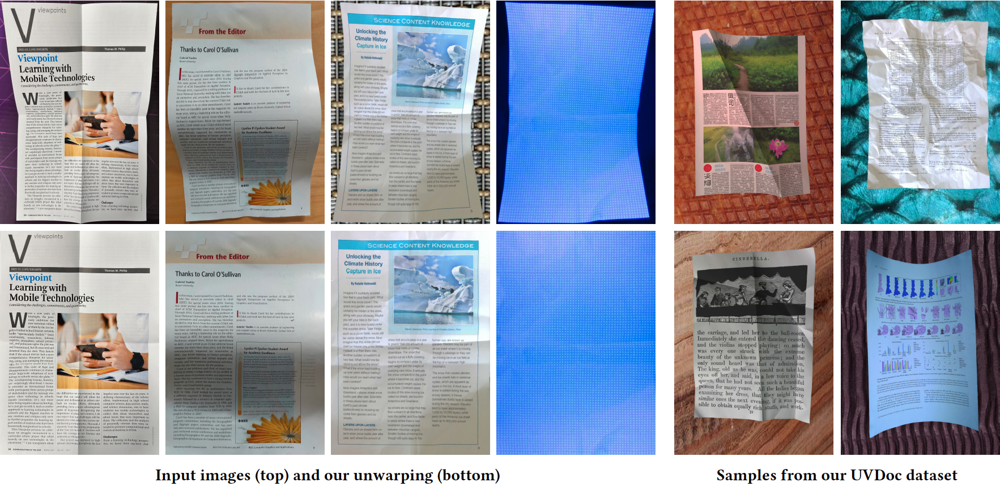

# UVDoc: Neural Grid-based Document Unwarping



This repository contains the code for the "UVDoc: Neural Grid-based Document Unwarping" paper.
If you are looking for (more information about) the UVDoc dataset, you can find it [here](https://github.com/tanguymagne/UVDoc-Dataset).

Three requirements files are provided for the three use cases made available in this repo. 
Each use case is detailed below.


## Demo
> **Note** : Requirements
> 
> Before trying to unwarp a document using our model, you need to install the requirements. To do so, we advise you to create a virtual environment. Then run `pip install -r requirements_demo.txt`.

To try our model (available in this repo at `model/best_model.pkl`) on your custom images, run the following:
```shell
python demo.py --img-path [PATH/TO/IMAGE] 
```

You can also use a model you trained yourself by specifying the path to the model like this:
```shell
python demo.py --img-path [PATH/TO/IMAGE] --ckpt-path [PATH/TO/MODEL]
```


## Model training
> **Note** : Requirements
> 
> Before training a model, you need to install the requirements. To do so, we advise you to create a virtual environment. Then run `pip install -r requirements_train.txt`.

To train a model, you first need to get the data:
- UVDoc dataset can be accessed [here](https://igl.ethz.ch/projects/uvdoc/UVDoc_final.zip).
- The Doc3D dataset can be downloaded from [here](https://github.com/cvlab-stonybrook/doc3D-dataset). We augmented this dataset with 2D grids and 3D grids that are available [here](https://igl.ethz.ch/projects/uvdoc/Doc3D_grid.zip).

Then, unzip the downloaded archive into the data folder. The final structure of the data folder should be as follows:
```
data/
├── doc3D
│   ├── grid2D
│   ├── grid3D
│   ├── bm
│   └── img
└── UVDoc
    ├── grid2d
    ├── grid3d
    ├── img
    ├── img_geom
    ├── metadata_geom
    ├── metadata_sample
    ├── seg
    ├── textures
    ├── uvmap
    ├── warped_textures
    └── wc
```

Once this is done, run the following:
```shell
python train.py
```

Several hyperparameters, such as data augmentations, number of epochs, learning rate, or batch size can be tuned. To learn about them, please run the following:
```shell
python train.py --help
```


## Evaluation
> **Note** : Requirements
> 
> Before evaluating a model, you need to install the requirements. To do so, we advise you to create a virtual environment. Then run `pip install -r requirements_eval.txt`.
>
> You will also need to install `matlab.engine`, to allow interfacing matlab with python. To do so, you first need to find the location of your matlab installation (for instance, by running `matlabroot` from within matlab). Then go to `<matlabroot>/extern/engines/python` and run `python setup.py install`. You can open a python prompt and run `import matlab.engine` followed by `eng = matlab.engine.start_matlab()` to see if it was successful.
>
> Finally you might need to install `tesseract` via `sudo apt install tesseract-ocr libtesseract-dev`.

You can easily evaluate our model or a model you trained yourself using the provided script.
Our model is available in this repo at `model/best_model.pkl`.

### DocUNet benchmark
To make predictions using a model on the DocUNet benchmark, please first download the DocUNet Benchmark (available [here](https://www3.cs.stonybrook.edu/~cvl/docunet.html)) and place it under data to have the following structure:
```
data/
└── DocUNet
    ├── crop
    ├── original
    └── scan
```

Then run: 
```shell
python docUnet_pred.py --ckpt-path [PATH/TO/MODEL]
```
This will create a `docunet` folder next to the model, containing the unwarped images.

Then to compute the metrics over these predictions, please run the following:
```shell
python docUnet_eval.py --pred-path [PATH/TO/UNWARPED]
```
### UVDoc benchmark
To make predictions using a model on the UVDoc benchmark, please first download the UVDoc Benchmark (available [here](https://igl.ethz.ch/projects/uvdoc/)) and place it under data to have the following structure:
```
data/
└── UVDoc_benchmark
    ├── grid2d
    ├── grid3d
    └── ...
```
Then run: 
```shell
python uvdocBenchmark_pred.py --ckpt-path [PATH/TO/MODEL]
```
This will create a `output_uvdoc` folder next to the model, containing the unwarped images.

Then to compute the metrics over these predictions, please run the following:
```shell
python uvdocBenchmark_eval.py --pred-path [PATH/TO/UNWARPED]
```

#### :exclamation: Erratum
The MS-SSIM and AD values for the UVDoc benchmark reported in our paper mistakenly were calculated based on only half of the UVDoc benchmark (for our method as well as related works). 
We here report the old and the corrected values on the entire UVDoc benchmark:
|    :white_check_mark: New :white_check_mark:       | MS-SSIM | AD    |
|-----------|---------|-------|
| DewarpNet | 0.589   | 0.193 |
| DocTr     | 0.697   | 0.160 |
| DDCP      | 0.585   | 0.290 |
| RDGR      | 0.610   | 0.280 |
| DocGeoNet | 0.706   | 0.168 |
| Ours      | 0.785   | 0.119 |

|      :x: Old :x: | MS-SSIM | AD    |        
|-----------|---------|-------|
| DewarpNet | 0.6     | 0.189 |
| DocTr     | 0.684   | 0.176 |
| DDCP      | 0.591   | 0.334 |
| RDGR      | 0.603   | 0.314 |
| DocGeoNet | 0.714   | 0.167 |
| Ours      | 0.784   | 0.122 |

## Resulting images
You can download the unwarped images that we used in our paper:
* [Our results for the DocUNet benchmark](https://igl.ethz.ch/projects/uvdoc/DocUnet_results.zip)
* [Our results for the UVDoc benchmark](https://igl.ethz.ch/projects/uvdoc/UVDocBenchmark_results.zip)
* [The results of related work for the UVDoc benchmark](https://igl.ethz.ch/projects/uvdoc/UVDocBenchmark_results_RelatedWorks.zip) (generated using their respective published pretrained models)

## Citation
If you used this code or the UVDoc dataset, please consider citing our work:
```
@inproceedings{UVDoc,
title={{UVDoc}: Neural Grid-based Document Unwarping},
author={Floor Verhoeven and Tanguy Magne and Olga Sorkine-Hornung},
booktitle = {SIGGRAPH ASIA, Technical Papers},
year = {2023},
url={https://doi.org/10.1145/3610548.3618174}
}
```
